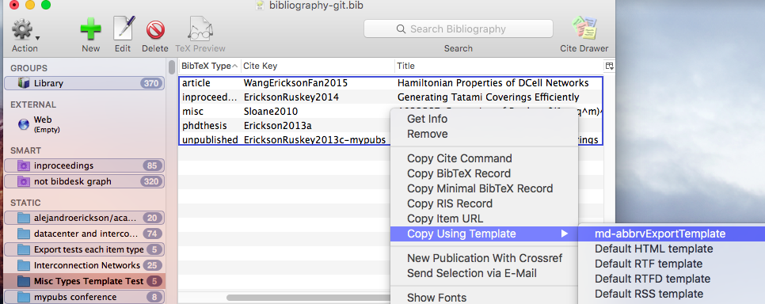

# bibdesk-bibtex-markdown
A BibDesk Template to export to BibTeX entries to Markdown (with linky titles!)

[BibDesk](http://bibdesk.sourceforge.net) is a bibliography management tool for
Mac OS X that uses BibTeX as its source files. One of my favourite features is copying records to a variety of formats using [templates](https://sourceforge.net/p/bibdesk/wiki/Templates/ "BibDesk template wiki").

New templates can be added to BibDesk in Preferences->Templates.

The Markdown export template that you can build from this repository's files
works on various BibTeX types, and it turns the title into a link if the Url
field is working correctly (more details below). BibDesk also handles LaTeX
accents if they are enclosed in {}, so that r{\'e}sum{\'e} exports as résumé.

You use it simply by selecting the records you want to export, right click, and use Copy Using Template -> The Markdown Template. That's what's happening in the screenshot below.



For the example I chose to export several types of records at the same time:
article, inproceedings, misc, phdthesis, unpublished.

Here some sample output.

* X. Wang, A. Erickson, J. Fan, and X. Jia.  
**[Hamiltonian Properties of DCell Networks](http://comjnl.oxfordjournals.org/content/58/11/2944.abstract)**. The Computer Journal, 58(11):2944--2955, 2015.

* A. Erickson and F. Ruskey.  
**[Generating Tatami Coverings Efficiently](http://arxiv.org/abs/1403.4776)**. Proc. of the international conference Génération Aléatoire de Structures Combinatoires (GASCom), Bertinoro, Italy, 2014.

* N. J. A. Sloane.  
**A022567, Expansion of Product $(1 + q^m)^2; m=1..\infty$**. 2010.

* A. Erickson.  
**[Monomino-Domino Tatami Coverings](http://hdl.handle.net/1828/4902)**. University of Victoria, 2013.

* A. Erickson and F. Ruskey.  
**[Enumerating maximal tatami mat coverings of square grids with $v$ vertical dominoes](http://arxiv.org/abs/1304.0070)**. Manuscript in preparation, 2013.

### Below is the (cleaned) source  for those entries ###

```
@article{WangEricksonFan2015,
	Author = {Wang, Xi and Erickson, Alejandro and Fan, Jianxi and Jia, Xiaohua},
	Doi = {10.1093/comjnl/bxv019},
	Journal = {The Computer Journal},
	Number = {11},
	Pages = {2944--2955},
	Title = {{H}amiltonian Properties of {DC}ell Networks},
	Url = {http://comjnl.oxfordjournals.org/content/58/11/2944.abstract},
	Volume = {58},
	Year = {2015},
	Bdsk-Url-1 = {http://comjnl.oxfordjournals.org/content/58/11/2944.abstract},
	Bdsk-Url-2 = {http://dx.doi.org/10.1093/comjnl/bxv019}}

@inproceedings{EricksonRuskey2014,
	Author = {Alejandro Erickson and Frank Ruskey},
	Booktitle = {Proc. of the international conference G{\'e}n{\'e}ration Al{\'e}atoire de Structures Combinatoires (GASCom), Bertinoro, Italy},
	Month = {June},
	Note = {8 pages},
	Timestamp = {2014.11.06},
	Title = {Generating Tatami Coverings Efficiently},
	Url = {http://arxiv.org/abs/1403.4776},
	Year = {2014},
	Bdsk-Url-1 = {http://arxiv.org/abs/1403.4776}}

@misc{Sloane2010,
	Author = {N. J. A. Sloane},
	Howpublished = {Published electronically at \url{http://oeis.org}, The On-Line Encyclopedia of Integer Sequences},
	Title = {A022567, Expansion of Product $(1 + q^m)^2; m=1..\infty$},
	Year = {2010}}

@phdthesis{Erickson2013a,
	Address = {Canada},
	Author = {Alejandro Erickson},
	Month = {August},
	School = {University of Victoria},
	Title = {Monomino-Domino Tatami Coverings},
	Url = {http://hdl.handle.net/1828/4902},
	Year = {2013},
	Bdsk-Url-1 = {http://hdl.handle.net/1828/4902}}

@unpublished{EricksonRuskey2013c-mypubs,
	Author = {Erickson, Alejandro and Ruskey, Frank},
	Note = {Manuscript in preparation},
	Title = {Enumerating maximal tatami mat coverings of square grids with $v$ vertical dominoes},
	Url = {http://arxiv.org/abs/1304.0070},
	Year = {2013},
	Bdsk-Url-1 = {http://arxiv.org/abs/1304.0070}}
```

### Getting URLs to work ###

BibDesk converts URLs found the the Url field on start up, so if your URLs are not working, close and open the BibTeX file (BibDesk itself doesn't need to be restarted).

### Things you might want to change ###

Due to my own preferences, the output has the following idiosyncracies:

  * Output is a list; items start with a *
  * Authors appear on their own line.
  * Authors appear as "J. Doe"
  * **Titles are in bold**
  * Titles are hyperlinked if a link exists (and the link address is not
    displayed anywhere)

### Issues ###

  * Page ranges 8--10 that use two dashes don't convert to single dashes
    automatically.
